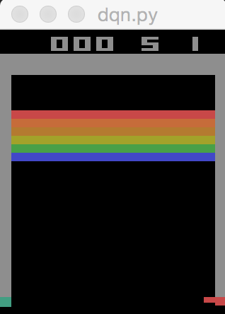

# dqn-gym
a practice imprimentation of dqn with open-ai gym.

# requirements
- python 3.6+
- tensorflow 1.0+
- keras 2.0+
- scipy
- numpy

# how to use
```
python dqn.py --mode=<train or test or random> --env_name=<open-ai gym's Atari environment name>
```

## mode
- train: train Deep Q-Network
- test: test using trained parameters
- random: playing random

## env_name
Default game is 'Breakout-v0' but you can play other games of Atari. Let's pick up from https://gym.openai.com/envs#atari.

### Breakout-v0

